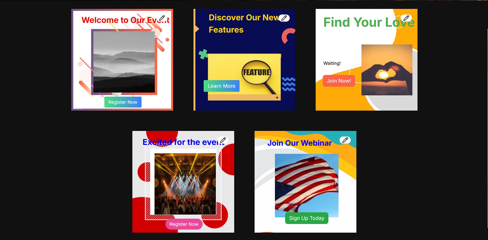
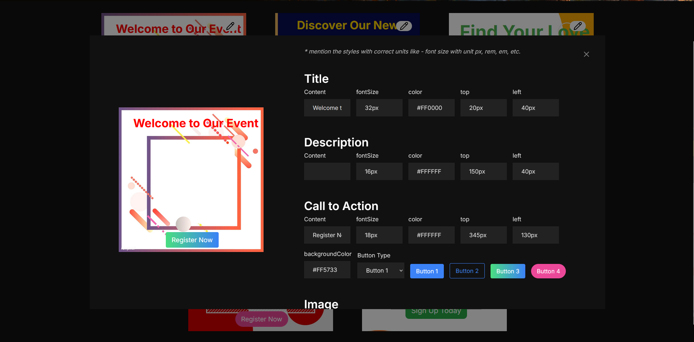

# Grow Easy Assessment


<br />
<br />


### Description

In this assessment I have tried to create a list of banners. If you click on the edit option a modal opens an edit form. After editing and saving the form the changes arre reflected in the list displayed on the screen

### Tech Stack & External Packages
* Next.js
* Tailwind css
* Lucide Icons

## Installation
Step I - clone this repository
```
git clone https://github.com/dnyaneshwar411/Grow-Easy-Frontend-Assessment.git
```

Step II - move to the root directory of the project if not already at the location.

Step III - install node modules
```
npm install
```

Step IV - start the local server
```
npm run dev
```

<br/>
You can check out the project at this link (deployed) - <a href="https://k-rite-dnyaneshwar-kawade.vercel.app/"><strong>Grow Easy</strong></a>

<br/>
I hope to hear from you soon contact me

* Phone - <a href="tel: 9067183889"><strong>9067183889</strong></a>
* Mail - <a href="mailto: dnyaneshwarpk20@gmail.com"><strong>dnyaneshwarpk20@gmail.com</strong></a>